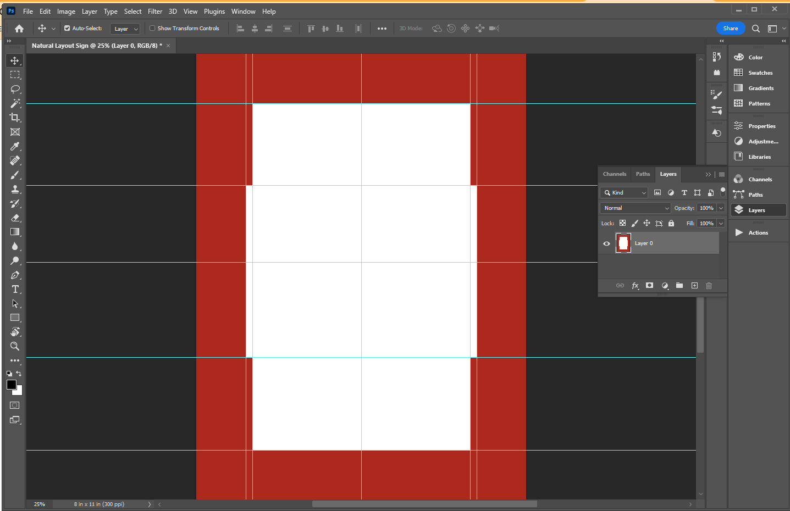

Early Preview Notice
==============

This page provides information about my Photoshop script for Photoshop Natural Layout. The current version is in beta and has the following shortcomings:

* The program can only create a new document (the feature to resize an existing document using the checkboxes is not yet implemented)
* The program was not tested on Mac or older versions of Photoshop and is only known to be working on Photoshop 2022

---

Photoshop Natural Layout
========================

This script will create the layout template for sign making following the formula described in **[Mike Steve's book "Mastering Layout"](https://www.amazon.com/Mastering-Layout-Art-Eye-Appeal/dp/091138068X/ref=asc_df_091138068X/?tag=hyprod-20&linkCode=df0&hvadid=312138007830&hvpos=&hvnetw=g&hvrand=17271656727451405095&hvpone=&hvptwo=&hvqmt=&hvdev=c&hvdvcmdl=&hvlocint=&hvlocphy=9003526&hvtargid=pla-526333469028&psc=1&tag=&ref=&adgrpid=60258871097&hvpone=&hvptwo=&hvadid=312138007830&hvpos=&hvnetw=g&hvrand=17271656727451405095&hvqmt=&hvdev=c&hvdvcmdl=&hvlocint=&hvlocphy=9003526&hvtargid=pla-526333469028)**. I originally came across the concept when watching my favorite reverse glass YouTuber, Paul Chamberlain who runs the channel **[Happy Gilder](https://www.youtube.com/channel/UC5isMTsFMUaOR-AChVx0aVw)** and has a very active **[facebook group](https://www.facebook.com/groups/885469372033249/)**.

Paul describes the use of the template and created a Photoshop set of actions, however due to the limitations in Photoshop actions - there is a more elegant way to accomplish the same with the use of Javascripting (or as Adobe calls their adaptation "ExtendScript").

# Using the script

When you load my script you will see the following dialog:

Enter the desired dimensions for the sign you are creating and click the "Start" button. That's it! The result will be a single layer document which looks as follows:

> Note:
>
> The guides and shape of the template will be calculated according to the dimensions you select

# Installation Instructions

### To run this script manually:

  File -> Scripts -> Browse...
  [and select this file from the location you downloaded it to]

### To add the script to Photoshop:

1. Add the script file **[Natural Layout.jsx](src/Natural%20Layout.jsx)** to the Photoshop script folder
   >the source script is in the "[src](src/)" folder in this repository

      **Mac OS:**
      Macintosh HD:Applications:Adobe Photoshop 2021:Presets:Scripts

      **Windows:**
      C:\Program Files\Adobe\Adobe Photoshop 2022\Presets\Scripts
      >obviously the path will differ for you, depending on the version on Photoshop you have

2. Restart Photoshop

3. Now you can select the script from File -> Scripts -> Natural Layout

# Credits

Tiran Dagan, [Board To Home](https://www.boardtohome.com)
You are free to use and adjust this script. Please feel free to fork or contribute to the development of this script.